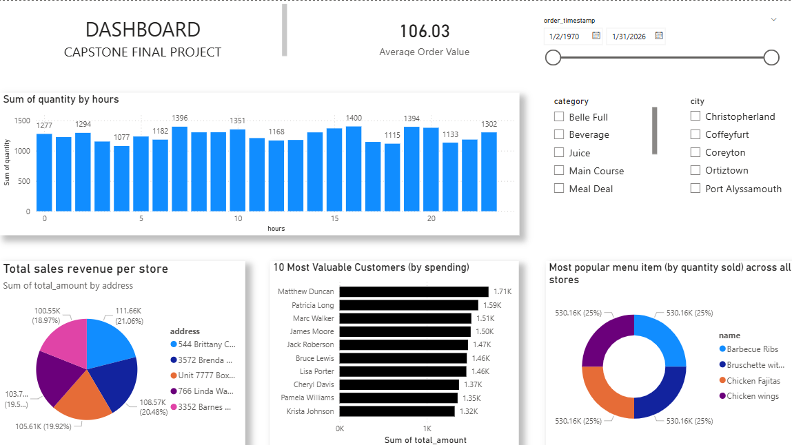

# RushMore Pizzeria – Enterprise Database System

## Introduction
This project designs and implements a production-ready PostgreSQL database system for RushMore Pizzeria. The goal is to replace the legacy JSON-based order storage with a scalable relational database capable of supporting multiple store locations, thousands of customers, and high transaction volumes.

The system is deployed in the cloud and populated with realistic synthetic data using Python and Faker to simulate real business operations while protecting customer privacy.

## Achitecture

## Objectives

- Design a normalized relational database schema (3NF)
- Deploy PostgreSQL to a cloud database service
- Generate and insert 10,000+ realistic records using Python
- Demonstrate system readiness for analytics and reporting

## Tech Stack                  Technology used

* Cloud                       Azure
* Programming                 Python3
* Data Generation             Faker
* Database                    Postgres
* Editor                      Visual Studio
* Analytics                   Power BI

## Data Model

## Database Schema
Core Tables:
- Stores – Physical store locations
- Customers – Customer information
- Ingredients – Inventory master list
- Menu_Items – Product catalog
- Orders – Customer transactions
- Order_Items – Line items per order

## Business Analysys with POWER BI

# HOW TO RUN THIS PROJECT

1.  git clone <https://github.com/Lekwacious-dev/capstone_rushmore_casestudy>
2.  Extract downloaded file and load to your preferred editor
3.  pip install python3 psycopg2-binary faker python-dotenv
4.  Configure Environment Variables
    Create .env file:
    DB_HOST=your_host
    DB_NAME=rushmore_db
    DB_USER=your_user
    DB_PASSWORD=your_password
    DB_PORT=5432
5.  Run Database Schema (TABLE.sql file)
5.  Run Data Population Script (populate.ipynb)

## DATA PRIVACY

No real customer data is used.
All data is synthetically generated for testing and demonstration purposes.

## Author

Ikenna Kingsley Ezeanochie (Lekwacious-dev)
Data Engineering Capstone Project
